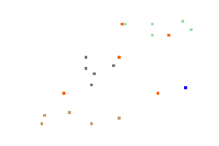

# FiMDP - Fuel in Markov Decision Processes
**Python Package with Algorithms for Controller Synthesis in Resource-constrained Markov Decision Processes**

[](https://fimdp.readthedocs.io/en/latest/?badge=latest) [](https://mybinder.org/v2/gh/xblahoud/FiMDP/master) [](https://travis-ci.org/xblahoud/FiMDP)


## Overview

**FiMDP** is a Python package designed around a proof-of-concept tool implementing algorithms developed in our work on 
controller synthesis for resource-constrained problems modeled as Consumption Markov Decision Processes (CMDPs). The algorithms
are detailed in the work titled 'Qualitative Controller Synthesis for Consumption Markov Decision Processes' by 
František Blahoudek, Tomáš Brázdil, Petr Novotný, Melkior Ornik, Pranay Thangeda and Ufuk Topcu [[1]](#1).

## Installation

FiMDP can be installed using pip from PyPI
```
pip install -U fimdp
```
While the baseline package has minimal dependencies, FiMDP depends on several other tools for extended functionality. Some of the recommended dependencies are:

* [FiMDPEnv](https://github.com/FiMDP/FiMDPEnv): Sample environments for testing FiMDP. 
* [Storm](https://www.stormchecker.org/index.html): For reading PRSIM models.
* [Stormpy](https://moves-rwth.github.io/stormpy/): Python bindings for Storm. 
* [Spot](https://spot.lrde.epita.fr/): For Linear-time Temporal Logic (LTL) problems.


## Evaluations
We evaluate the performance of different solvers proposed in the tool and compare them with Storm in the notebooks provided in the [evaluation repository](https://github.com/FiMDP/FiMDP-Evaluation).

<p align="center">

<br>
<em>Multiple agents following energy-aware policies in UUVEnv from <a href="https://github.com/FiMDP/FiMDPEnv">FiMDPEnv</a>.  </em>
</p>


## Documentation (work in progress)
For a complete overview of the tool, installation options, documentation, and interactive examples refer to [FiMDP readthedocs](https://fimdp.readthedocs.io/).

## Contact
If you have any trouble with the installation, or have any questions, raise an issue or email [František Blahoudek](fandikb@gmail.com) or [Pranay Thangeda](contact@prny.me).

## References
<a id="1">[1]</a> 
Blahoudek F., Brázdil T., Novotný P., Ornik M., Thangeda P., Topcu U. (2020) Qualitative Controller Synthesis for Consumption Markov Decision Processes. In: Lahiri S., Wang C. (eds) Computer Aided Verification. CAV 2020. Lecture Notes in Computer Science, vol 12225. Springer, Cham. https://doi.org/10.1007/978-3-030-53291-8_22 


